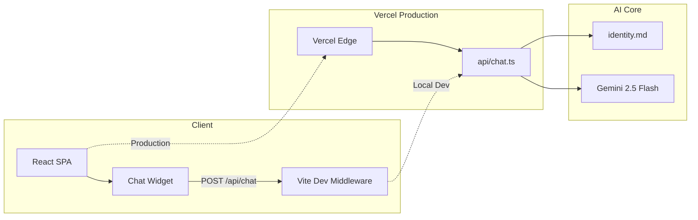

# Alex Joseph AI

A premium, minimal, type-safe personal developer showcase with an integrated autonomous AI chat agent. Built as a decoupled single-page application — a polished hero interface on the frontend, a serverless Gemini-powered knowledge engine on the backend.

---

## Overview

**Alex Joseph AI** is a full-viewport developer portfolio that pairs a distraction-free hero experience with an intelligent chat widget. Visitors interact with an AI persona grounded in a strict identity blueprint, delivering precise, markdown-formatted answers about engineering work, projects, certifications, and published articles.

The architecture is intentionally decoupled: the React frontend and Vercel serverless API operate independently, connected only through a single `/api/chat` endpoint.

---

## Features

- **Hero-only layout** — single-screen, no-scroll experience optimized for focus and impact
- **Alex Joseph AI chat widget** — floating assistant with smooth expand/collapse transitions
- **Markdown-rich responses** — bold text, lists, links, and code blocks rendered cleanly
- **Light & dark themes** — persistent theme toggle with smooth 300ms transitions
- **Fully responsive** — fluid typography and adaptive chat panel (full-screen on mobile, card on desktop)
- **Knowledge-grounded agent** — system instructions loaded from `api/identity.md` at runtime
- **Type-safe stack** — strict TypeScript across frontend and serverless backend
- **Vercel-ready** — deploys with zero manual configuration beyond environment variables

---

## Tech Stack

| Layer | Technology |
|-------|------------|
| **Frontend** | React 19, TypeScript, Vite 6 |
| **Styling** | Tailwind CSS 3, PostCSS, Autoprefixer |
| **Icons** | Lucide React |
| **Markdown** | react-markdown, remark-gfm |
| **AI** | Google Gen AI SDK (`@google/genai`) — Gemini 2.5 Flash |
| **Backend** | Vercel Serverless Functions (Node.js) |
| **Deployment** | Vercel |

---

## Architecture



**Local development:** Vite serves the frontend and proxies `/api/chat` through a custom dev middleware that loads environment variables from `.env`.

**Production:** Vercel serves the static build and executes `api/chat.ts` as a serverless function on each request.

---

## Project Structure

```
ai-chatbot-agent/
├── api/
│   ├── chat.ts              # Serverless chat handler (Gemini integration)
│   └── identity.md          # AI knowledge blueprint & persona constraints
├── public/
│   └── favicon.svg
├── src/
│   ├── components/
│   │   └── ChatMarkdown.tsx # Markdown renderer for assistant messages
│   ├── App.tsx              # Hero UI + chat widget
│   ├── main.tsx             # Application entry point
│   ├── index.css            # Tailwind directives & global styles
│   └── vite-env.d.ts
├── index.html
├── vite.config.ts           # Vite + local API middleware
├── tailwind.config.js
├── postcss.config.js
├── tsconfig.json
├── vercel.json              # SPA rewrites for client-side routing
├── package.json
├── .env.example
└── .gitignore
```

---

## Prerequisites

- **Node.js** 18 or later
- **npm** (or pnpm / yarn)
- A **Gemini API key** from [Google AI Studio](https://aistudio.google.com/apikey)

---

## Getting Started

### 1. Clone and install

```bash
git clone <repository-url>
cd ai-chatbot-agent
npm install
```

### 2. Configure environment variables

Copy the example file and add your Gemini API key:

```bash
cp .env.example .env
```

Edit `.env`:

```env
GEMINI_API_KEY=your_gemini_api_key_here
```

> **Never commit `.env` to version control.** It is already listed in `.gitignore`.

### 3. Run locally

```bash
npm run dev
```

Open [http://localhost:5173](http://localhost:5173) in your browser.

### 4. Build for production

```bash
npm run build
```

Preview the production build locally:

```bash
npm run preview
```

---

## Deploy to Vercel

1. Push the repository to GitHub, GitLab, or Bitbucket.
2. Import the project in the [Vercel Dashboard](https://vercel.com/new).
3. Add the environment variable:
   - **Name:** `GEMINI_API_KEY`
   - **Value:** your Gemini API key
4. Deploy.

Vercel automatically detects the Vite framework and maps `api/chat.ts` to the `/api/chat` route. No additional server configuration is required.

---

## API Reference

### `POST /api/chat`

Sends a message to the Alex Joseph AI agent and receives a grounded response.

**Request body:**

```json
{
  "message": "What projects have you built?",
  "history": [
    { "role": "user", "content": "Hello" },
    { "role": "assistant", "content": "Hi — I'm Alex Joseph AI..." }
  ]
}
```

| Field | Type | Required | Description |
|-------|------|----------|-------------|
| `message` | `string` | Yes | The user's current message |
| `history` | `array` | No | Prior conversation turns for multi-turn context |

**Success response (`200`):**

```json
{
  "reply": "I built **SkillLink**, a full-stack marketplace..."
}
```

**Error responses:**

| Status | Body | Cause |
|--------|------|-------|
| `400` | `{ "error": "Message is required" }` | Empty or missing message |
| `405` | `{ "error": "Method not allowed" }` | Non-POST request |
| `500` | `{ "error": "GEMINI_API_KEY is not configured" }` | Missing API key |
| `500` | `{ "error": "Failed to generate response" }` | Gemini API failure |

CORS preflight (`OPTIONS`) is supported with `Access-Control-Allow-Origin: *`.

---

## AI Knowledge Engine

The agent's personality, background, and knowledge boundaries are defined in `api/identity.md`. This file is read at runtime and injected as the Gemini `systemInstruction`.

Key behaviors enforced by the blueprint:

- First-person voice as Alex Joseph's technical proxy
- Structured markdown responses (bold, lists) for scannability
- Strict out-of-scope handling — no guessing beyond documented facts
- Graceful fallback with direct contact details when data is unavailable

To update what the agent knows, edit `api/identity.md` and redeploy. No code changes are required.

---

## Design System

| Token | Light Mode | Dark Mode |
|-------|------------|-----------|
| Background | `#FFFFFF` | `#0B0F19` |
| Text | `#0F172A` | `#FFFFFF` |
| Accent | `#0056D2` (Electric Blue) | `#0056D2` |

Theme transitions apply a **300ms ease-in-out** curve to background, text, and border properties.

---

## Scripts

| Command | Description |
|---------|-------------|
| `npm run dev` | Start Vite dev server with local API middleware |
| `npm run build` | Type-check and build for production |
| `npm run preview` | Serve the production build locally |

---

## Author

**Joseph Alex Mudavia** (Alex Joseph)  
Software Engineer · Tech Entrepreneur · Solutions Architect

- Email: [josephmudavia@gmail.com](mailto:josephmudavia@gmail.com)
- GitHub: [@josephalexofficial](https://github.com/josephalexofficial)
- LinkedIn: [josephalexofficial](https://linkedin.com/in/josephalexofficial)
- X: [@web3wiztron](https://x.com/web3wiztron)

---

## License

This project is private. All rights reserved.
